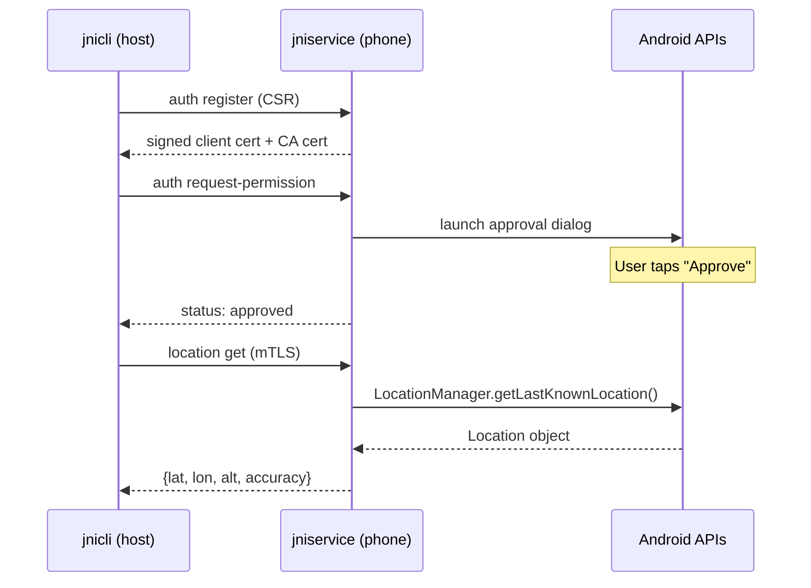
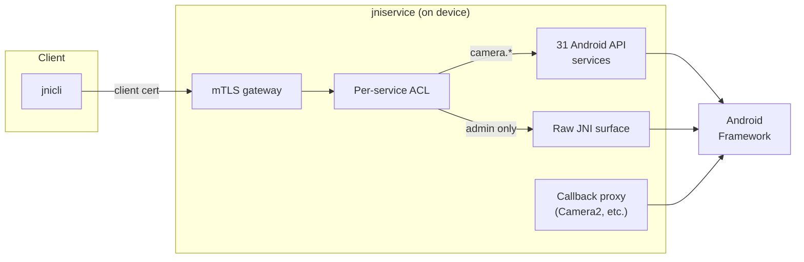

# jni-proxy

gRPC proxy layer for [AndroidGoLab/jni](https://github.com/AndroidGoLab/jni).

Exposes Android JNI bindings over gRPC so that a host machine can control an
Android device remotely. Includes `jniservice` (the on-device gRPC server),
`jnicli` (the command-line client), and `jniserviceadmin` (ACL management).

## Components

- **cmd/jnicli** -- CLI client that talks to jniservice over gRPC
- **cmd/jniservice** -- gRPC server that runs on the Android device (APK or Magisk module)
- **cmd/jniserviceadmin** -- Admin CLI for ACL management
- **grpc/** -- gRPC server and client wrappers
- **proto/** -- Protobuf service definitions
- **handlestore/** -- Object handle mapping for cross-process JNI references
- **tools/cmd/callbackgen** -- Code generator for Java callback adapter classes

## gRPC Remote Access

The gRPC layer turns any Android phone into a remotely accessible API server. A companion service (`jniservice`) runs on the device -- either as an APK (non-rooted) or a Magisk module (rooted, auto-starts on boot). Clients on any machine connect over the network using `jnicli`.



Each client registers with a unique certificate (mTLS). Method access is controlled by per-service ACLs -- the device owner approves which services each client can use through an on-screen dialog:



**Available services** include camera, location, bluetooth, WiFi, telephony, battery, power, alarm, vibrator, audio, NFC, notifications, and more (31 services total, ~2000 RPCs). Callback-based APIs (like Camera2) work through a bidirectional streaming proxy with build-time generated adapter classes.

## Running jniservice on Android

jniservice is a gRPC server that exposes the JNI surface and Android APIs over the network.

### Development (via adb)

```bash
make deploy                    # build, push, start, forward port
make deploy HOST_PORT=50052    # use different host port
make stop-server               # stop the server
```

### Rooted devices (Magisk module)

Auto-starts on boot. Self-contained -- no `make deploy` needed after install.

```bash
make magisk DIST_GOARCH=arm64                          # build module
adb push build/jniservice-magisk-arm64-v8a.zip /sdcard/
adb shell su -c "magisk --install-module /sdcard/jniservice-magisk-arm64-v8a.zip"
adb reboot                                             # starts on next boot
```

Configuration (optional): create `jniservice.env` in the Magisk module directory:
```bash
JNISERVICE_PORT=50051
JNISERVICE_LISTEN=0.0.0.0
```

### Non-rooted devices (APK)

Auto-starts on boot via foreground service.

```bash
make apk DIST_GOARCH=arm64          # build APK
adb install build/jniservice-arm64-v8a.apk
```

Open "jniservice" from the launcher once to start the service and register the boot receiver.

### Connecting

On the device itself:
```bash
jnicli --addr localhost:50051 --insecure jni get-version
```

From another machine (via adb port forwarding):
```bash
adb forward tcp:50051 tcp:50051
jnicli --addr localhost:50051 --insecure jni get-version
```

## E2E Test Verification

Run `make test-emulator` to test against a connected device or emulator. Tests skip when `JNICTL_E2E_ADDR` is not set.

<details>
<summary>Verified platforms (click to expand)</summary>

| Type | Device | Android | API | ABI | Build | Date | Passed | Total |
|------|--------|---------|-----|-----|-------|------|--------|-------|
| Phone | Pixel 8a | 16 | 36 | arm64-v8a | BP4A.260205.001 | 2026-03-14 | 21 | 21 |
| Emulator | sdk_gphone64_x86_64 | 15 | 35 | x86_64 | | 2026-03-14 | 21 | 21 |

</details>

## Quick Start

```bash
# Build the CLI for Linux
make dist-jnicli-linux

# Build and deploy to a connected Android device
make deploy

# Run E2E tests
make test-emulator
```

## Security

> **Security disclaimer:** This is a hobby/research project. The mTLS + ACL system provides basic access control, but it has not been audited and should not be relied upon for security-critical deployments. The self-signed CA, handle-based object references, and raw JNI surface all have inherent attack surface. Use it on trusted networks for development, testing, and experimentation.

## Dependencies

This module depends on [github.com/AndroidGoLab/jni](https://github.com/AndroidGoLab/jni) for core JNI bindings and code generation tools.
When developing locally, use a `go.work` file pointing to both repos.
